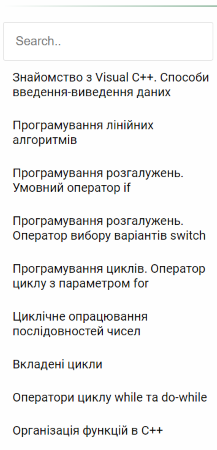

#   **[YOUR ASSISTANT ](https://daria-zaiets.github.io/assistant-for-the-subject-of-FPAL/)**

This is a starting template of the electronic reference book for the subject "Fundamentals of programming and algorithmic languages". 

:link: https://daria-zaiets.github.io/assistant-for-the-subject-of-FPAL/

### :computer: ***Сomputer version*** :zap:

### :iphone: ***Mobile version*** :phone:

 This site is my undergraduate college job. The goal of the project is to make a template for an electronic reference book for academic subjects. See below in more detail.

 

## :electric_plug:  **How to use** :bulb:
### ***Homepage***
The homepage contains links to all sections of the reference book. Each link is a block with an image and a title. You need to select a topic and click.

There are some more useful links at the top of the page.

Links are implemented with flebox, so adding new elements is easy.

### ***Typical page***
Typical page has 2 parts. First part is a tutorial text, that explains the selected topic.

Second part is a filter. Use it to navigate topics without going to home.

All other pages will be made in the same way as a typical.

 

## :wrench: **Project setup** :hammer:  

You can see the project by the *[link](https://daria-zaiets.github.io/assistant-for-the-subject-of-FPAL/)*.

You also can clone this repo and open in your favorite browser `index.html` file.

 

## :trident: **Future scope** :moneybag:
* *Design* - create a professional design
* *Filtration* - fix character matching problem, add to mobile version
* *Menu* - improve menu display for mobile devices
* *Search* - add search

 

## :love_letter: Contact the author :mailbox_with_no_mail:
:email: zaiets.dar@gmail.com